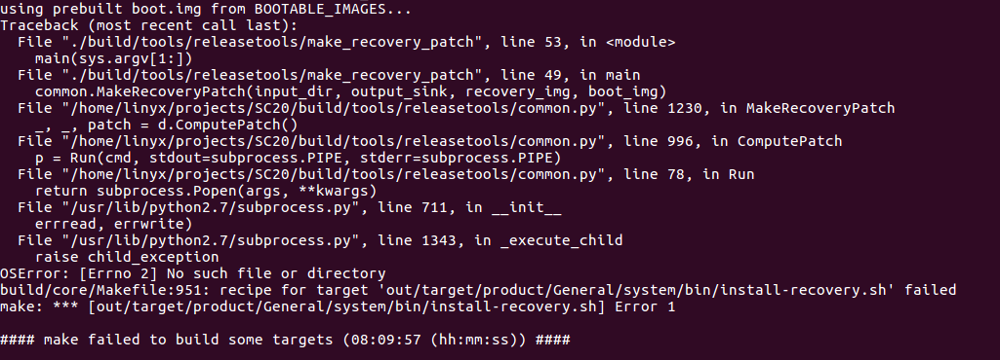

Ubuntu16.04编译出错

参考网上做如下修改：
```
diff --git a/art/build/Android.common_build.mk b/art/build/Android.common_build.mk
index 6ce3877..b9f9502 100644
--- a/art/build/Android.common_build.mk
+++ b/art/build/Android.common_build.mk
@@ -116,7 +116,7 @@ endif
 
 # Host.
 ART_HOST_CLANG := false
-ifneq ($(WITHOUT_HOST_CLANG),true)
+ifneq ($(WITHOUT_HOST_CLANG),false)
   # By default, host builds use clang for better warnings.
   ART_HOST_CLANG := true
 endif
```

对ld做修改：
```
ln -s prebuilts/gcc/linux-x86/host/x86_64-linux-glibc2.11-4.6/x86_64-linux/bin/ld /usr/bin/ld.gold
```

重新执行如下命令：
make update-api

再执行make -j4

编译成功