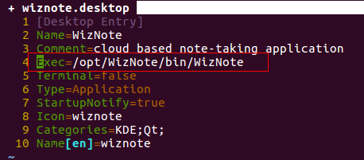

### 编译WizNote
具体编译步骤参考连接以下连接，时面请得很清楚：

[http://www.wiz.cn/compile-client.html](http://www.wiz.cn/compile-client.html)  
[https://www.jianshu.com/p/0b719bea9fa8](https://www.jianshu.com/p/0b719bea9fa8)

在解决不能输入中方的方法时顺序有所不一样：
安装完QT后，先把输入法支持的库拷贝过去，再编译WizNote.

### 解决中文输入法不能用

很多有中输入法的包其实已经有这个库了，使用locate命令找一下：
```
locate libfcitxplatforminputcontextplugin
#找到后，拷贝到如下两个目录
#~/Qt5.9.0/Tools/QtCreator/lib/Qt/plugins/platforminputcontexts/
#~/Qt5.9.0/5.9/gcc_64/plugins/platforminputcontexts/
```

如果电脑中没有也可以使用以下命令来安装，没必要去下代码编译。  
如果实在有需要，上面的两个连接中也有教程。
```
#使用如下命令，搜索下对应的包
sudo apt-cache search fcitx-qt5
#在我的源上能找到可安装的包，
sudo apt-get install libfcitx-qt5-1
```

### 在安装时遇到的问题
1. QT构建项目时遇到错误，打印log如下：
```
When executing step "CMake Build"
```
没找到打印原因 ，解决方法如下:  
构建->Clear Cmake Configuration  
构建->清理所有项目  

2. QTCreater项目构建完成后，无法运行（运行按钮是灰的）  
这个可能是QTCreater自身的原因

解决方法:  
关掉项目重新打开，或重新选择Debug，再次构建下。

### 安装到系统

1. 将最后得到的Package目录中的，WizNote目录拷贝到/opt目录下。

2. 修改wiznote.desktop文件中的Exec项为安装目录
并将desktop文件拷贝到~/.local/share/applications/目录中

3. 将Package目录中的logo拷贝到icon目录中
```
cp -rf logo/hicolor/* ~/.local/share/icons/hicolor/
```